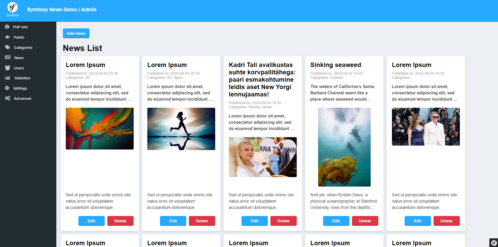

# Demo of Symfony application with administrator and public interfaces

## UI:





Easiest way to run:
- 1. With docker installed from project's root folder run command:
 ```
 docker compose up
 ```
It will create container and images for Symfony app and apply migrations
- 2. Navigate to http://localhost:8080/admin for administration
     (username: admin, password: admin) 
- 3. Navigate to http://localhost:8080/news to see the news

## Project structure:
 ```

```                    
